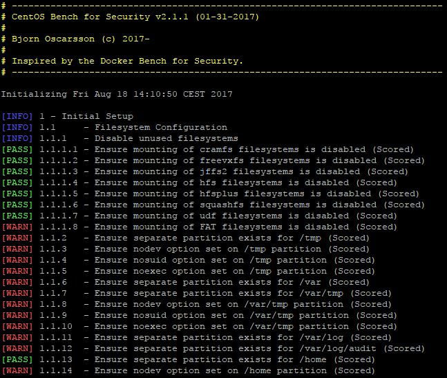

# CentOS Bench for Security



CentOS Bench for Security is a script that implements checks which follows the [CIS CentOS Linux 7 Benchmark](http://benchmarks.cisecurity.org) and is highly inspired by [Docker Bench for Security](https://github.com/docker/docker-bench-security).

## Running CentOS Bench for Security

Simply clone this repository and execute the shell script directly on your host:

```sh
git clone https://github.com/haxorof/centos-bench-security.git
cd centos-bench-security
sudo bash centos-bench-security.sh
```